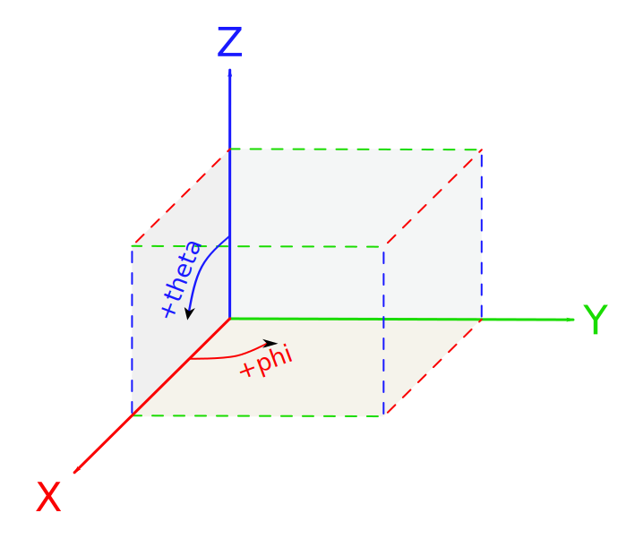
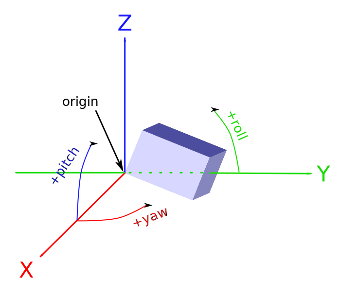
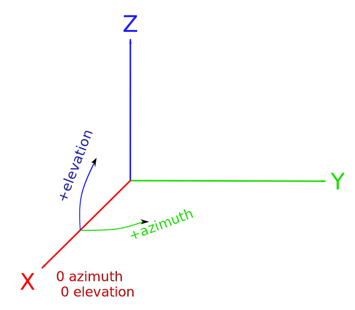

<p align="center">
  
</p>

<p align="center">
  <a href="https://github.com/radarsimx/radarsimpy/actions/workflows/unit_test_windows.yml"></a>
  <a href="https://github.com/radarsimx/radarsimpy/actions/workflows/unit_test_ubuntu.yml"></a>
  <a href="https://github.com/radarsimx/radarsimpy/actions/workflows/unit_test_macos.yml"></a>
  <a href="https://radarsimx.github.io/radarsimpy/"></a>
  <a href="https://radarsimx.com/product/radarsimpy/"></a>
</p>

# RadarSimPy

A **Radar** **Sim**ulator for **Py**thon

RadarSimPy is a powerful and versatile Python-based Radar Simulator that models radar transceivers and simulates baseband data from point targets and 3D models. Its signal processing tools offer range/Doppler processing, direction of arrival estimation, and beamforming using various cutting-edge techniques, and you can even characterize radar detection using Swerling’s models. Whether you’re a beginner or an advanced user, RadarSimPy is the perfect tool for anyone looking to develop new radar technologies or expand their knowledge of radar systems.

---

## Key Features

- :satellite: **Radar Modeling**
  - Transceiver modeling
  - Arbitrary waveform (CW, FMCW, PMCW, Pulse, ...)
  - Phase noise
  - Phase/amplitude modulation (CDM, FDM, DDM, TDM, ...)
  - Fast-time/slow-time modulation
- :video_game: **Simulation**
  - Baseband data from point targets & 3D models
  - Interference simulation
  - Target RCS simulation
  - LiDAR point cloud simulation
- :signal_strength: **Signal Processing**
  - Range/Doppler processing
  - DoA estimation (MUSIC, Root-MUSIC, ESPRIT, IAA)
  - Beamforming (Capon, Bartlett)
  - CFAR (CA-CFAR, OS-CFAR)
- :chart_with_upwards_trend: **Characterization**
  - Radar detection characteristics (Swerling’s models)

---

## Dependencies

- Python >= 3.9
- NumPy >= 2.0
- SciPy
- PyMeshLab, PyVista, trimesh, or meshio

```bash
pip install -r requirements.txt
```

**Platform-specific requirements:**

- **Windows**
  - [Visual C++ Runtime](https://aka.ms/vs/16/release/vc_redist.x64.exe/)
  - GPU version (CUDA13) – see [Minimum Required Driver Versions](https://docs.nvidia.com/deploy/cuda-compatibility/#id1)
- **Ubuntu 22.04**
  - GCC 11 (default)
  - GPU version (CUDA13) – see [Minimum Required Driver Versions](https://docs.nvidia.com/deploy/cuda-compatibility/#id1)
- **Ubuntu 24.04**
  - GCC 13 (default)
  - GPU version (CUDA13) – see [Minimum Required Driver Versions](https://docs.nvidia.com/deploy/cuda-compatibility/#id1)
- **Generic Linux x86-64**
  - Try Ubuntu 22.04/24.04 module, or [request a custom build](https://radarsimx.com/request-a-custom-build/)
- **MacOS**
  - Intel: GCC 14 (`brew install gcc@14`)
  - Apple Silicon: use default Clang (no extra dependency)

---

## Installation

Download the [pre-built module](https://radarsimx.com/product/radarsimpy/) and place the `radarsimpy` folder in your project directory:

```text
your_project.py
your_project.ipynb
radarsimpy/
  ├── __init__.py
  ├── [platform-specific binaries]
  ├── radar.py
  ├── processing.py
  └── ...
```

**Platform-specific binaries:**

- **Windows:** `radarsimcpp.dll`, `simulator.xxx.pyd`
- **Linux:** `libradarsimcpp.so`, `simulator.xxx.so`
- **MacOS:** `libradarsimcpp.dylib`, `simulator.xxx.so`

---

## Acceleration

This module supports CPU/GPU parallelization:

- **CPU:** via OpenMP
- **GPU:** via CUDA (since v6.0.0)

|         | CPU (x86-64) | CPU (ARM64) | GPU (CUDA) |
| ------- | ------------ | ----------- | ---------- |
| Windows | ✔️           | ❌️         | ✔️         |
| Linux   | ✔️           | ❌️         | ✔️         |
| MacOS   | ✔️           | ✔️          | ❌️        |


---

## Coordinate Systems

### Global Coordinate

- **axis** (m): `[x, y, z]`
- **phi** (deg): angle on the x-y plane. 0 deg is the positive x-axis, 90 deg is the positive y-axis
- **theta** (deg): angle on the z-x plane. 0 deg is the positive z-axis, 90 deg is the x-y plane



### Local Coordinate

- **yaw** (deg): rotation along the z-axis. Positive yaw rotates the object from the positive x-axis to the positive y-axis
- **pitch** (deg): rotation along the y-axis. Positive pitch rotates the object from the positive x-axis to the positive z-axis
- **roll** (deg): rotation along the x-axis. Positive roll rotates the object from the positive y-axis to the positive z-axis
- **origin** (m): `[x, y, z]`, the motion (rotation and translation) centor of the object. Radar's origin is always at `[0, 0, 0]`



- **azimuth** (deg): azimuth -90 ~ 90 deg equal to phi -90 ~ 90 deg
- **elevation** (deg): elevation -90 ~ 90 deg equal to theta 180 ~ 0 deg



---

## Usage Examples

Find more usage examples at [radarsimx.com](https://radarsimx.com/category/examples/). Source files are available in the [radarsimnb repository](https://github.com/radarsimx/radarsimnb).

- ### **Radar Systems & Waveforms**

  - [FMCW radar](https://radarsimx.com/2018/10/11/fmcw-radar/)
  - [Pulsed Radar](https://radarsimx.com/2024/09/13/pulsed-radar/)
  - [Doppler radar](https://radarsimx.com/2019/05/16/doppler-radar/)
  - [PMCW radar](https://radarsimx.com/2019/05/24/pmcw-radar/)
  - [Interferometric Radar](https://radarsimx.com/2023/08/31/interferometric-radar/)
  - [Arbitrary waveform](https://radarsimx.com/2021/05/10/arbitrary-waveform/)

- ### **MIMO & Multi-Channel Systems**

  - [TDM MIMO FMCW radar](https://radarsimx.com/2019/04/07/tdm-mimo-fmcw-radar/)
  - [Imaging radar](https://radarsimx.com/2022/12/02/imaging-radar/)
  - [DoA estimation](https://radarsimx.com/2022/12/12/doa-estimation/)

- ### **3D Scene Simulation & Ray Tracing**

  - [FMCW radar with a car](https://radarsimx.com/2021/05/10/fmcw-radar-with-a-car/)
  - [FMCW radar with a plate](https://radarsimx.com/2021/05/10/fmcw-radar-with-a-plate/)
  - [FMCW radar with a corner reflector](https://radarsimx.com/2021/05/10/fmcw-radar-with-a-corner-reflector/)
  - [Multi-path effect](https://radarsimx.com/2021/05/10/multi-path-effect/)
  - [Micro-Doppler](https://radarsimx.com/2021/05/10/micro-doppler/)
  - [Doppler of a turbine](https://radarsimx.com/2021/05/10/doppler-of-a-turbine/)

- ### **Radar Cross Section (RCS) Analysis**

  - [Cross-Polarization and Co-Polarization RCS](https://radarsimx.com/2024/04/19/cross-polarization-and-co-polarization-rcs/)
  - [Car RCS](https://radarsimx.com/2021/05/10/car-rcs/)
  - [Plate RCS](https://radarsimx.com/2021/05/10/plate-rcs/)
  - [Corner reflector RCS](https://radarsimx.com/2021/05/10/corner-reflector-rcs/)

- ### **Signal Processing & Detection**

  - [CFAR](https://radarsimx.com/2021/01/10/cfar/)
  - [CFAR with corner reflector](https://radarsimx.com/2021/05/10/fmcw-radar-with-a-corner-reflector/)

- ### **System Performance & Characterization**

  - [FMCW Radar Link Budget - Ideal Point Target](https://radarsimx.com/2024/10/11/fmcw-radar-link-budget-ideal-point-target/)
  - [Phase noise](https://radarsimx.com/2021/01/13/phase-noise/)
  - [Receiver operating characteristic (ROC)](https://radarsimx.com/2019/10/06/receiver-operating-characteristic/)
  - [Interference](https://radarsimx.com/2023/01/13/interference/)

- ### **LiDAR Simulation**

  - [LIDAR point cloud](https://radarsimx.com/2020/02/05/lidar-point-cloud/)

---

## Build

Check [Build Instructions](./build_instructions.md)

---

## API Reference

See the [Documentation](https://radarsimx.github.io/radarsimpy/)

---

## Contributing

Contributions, issues, and feature requests are welcome! Please open an issue or submit a pull request on GitHub.

---

## License

This project is licensed under the terms of the [LICENSE](LICENSE) file.
